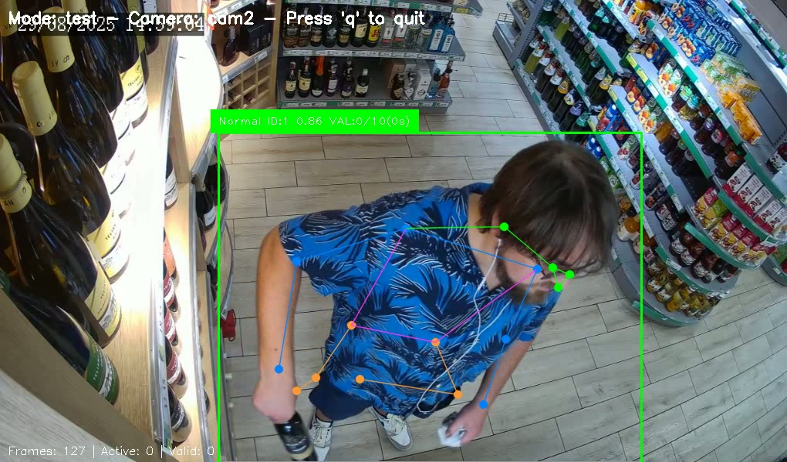
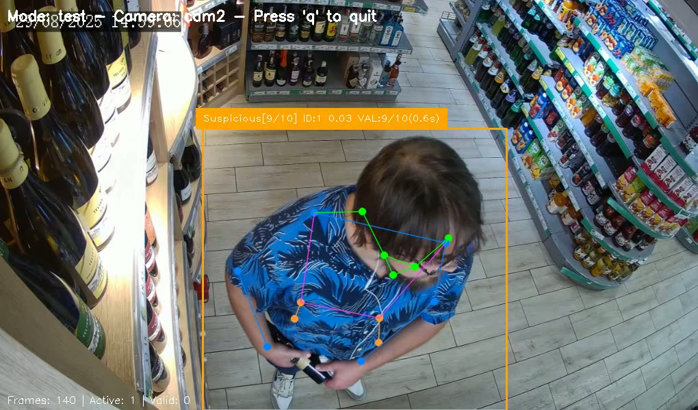
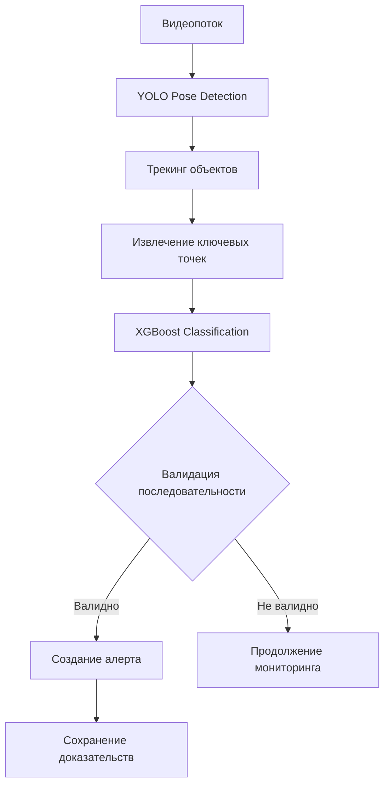
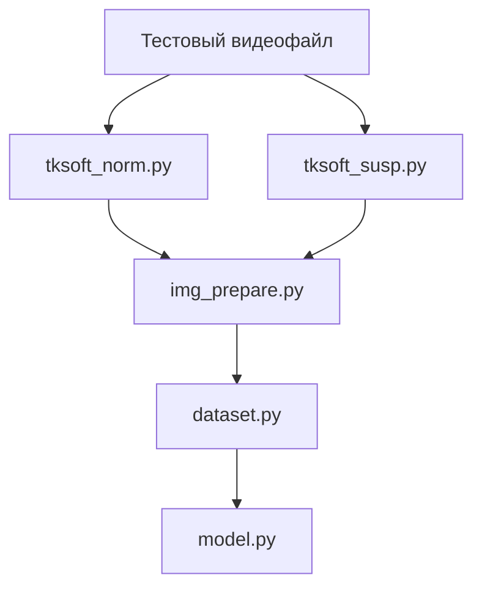

# 👁️‍🗨️  Shoplifting_Detection_System

## Система детекции подозрительного поведения (скрытия товара в магазине)

[](https://www.python.org/downloads/)
[](https://ultralytics.com/)
[](https://xgboost.ai/)

<p align="center">

</p>

## ✨ Возможности

- **🎯 Детектирование** - YOLO11-pose для точного определения позы человека
- **🤖 Классификация поведения** - XGBoost для идентификации подозрительных действий
- **🔄 Трекинг объектов** - отслеживание людей между кадрами
- **⚡ Валидация последовательностей** 
- **📊 Управление предупреждениями** - ограничение частоты алертов
- **📹  Выбор источника видеосигнала** - работа с различными источниками видео (веб-камера, IP-камера, видеофайлы)
- **💾 Сохранение доказательств** - автоматическое сохранение изображений и видеофрагментов
- **⚡Валидация подозрительного поведения по следующим критериям:**

*- Порог последовательных кадров: Минимальное количество последовательных подозрительных детекций*

*- Порог уверенности: Средняя уверенность модели должна быть ниже порога*

*- Минимальная длительность: Подозрительное поведение должно продолжаться минимальное время*

- **🔧 Гибкая конфигурация** - настройки для различных режимов работы
  
***🛠 Особенности тестового режима:***
  
*- Использование видеофайлов вместо RTSP потоков*

*- Подробное логирование работы*

*- Отображение видео с аннотациями*

*- Локальное сохранение алертов*

*- Упрощённые пороги валидации*

## 📸 Примеры работы

<p align="center">



</p>

**🎨 Цветовая кодировка поведения**:
- 🟢 Зеленый - нормальное поведение
- 🟠 Оранжевый - потенциально подозрительное (в процессе валидации)
- 🔴 Красный - подтвержденное подозрительное поведение


## 🏗️ Архитектура системы


## ⚙️ Установка

```bash
# Клонирование репозитория
git clone https://github.com/i-koskin/Shoplifting_Detection_System.git
cd Shoplifting_Detection_System

# Создание виртуального окружения
py -m venv venv
source venv/bin/activate  # Linux/MacOS
# или
venv\Scripts\activate  # Windows

# Установка зависимостей
pip install -r requirements.txt
```

## 📁 Структура проекта
.

├── **shoplifting_detector.py**   *# Основной скрипт детекции*

├── **tksoft_norm.py**            *# Модуль подготовки видеофайла с нормальным поведением*

├── **tksoft_susp.py**            *# Модуль подготовки видеофайла с подозрительным поведением*

├── **img_prepare.py**            *# Модуль подготовки изображений из подготовленных видеофайлов*

├── **dataset.py**                *# Модуль подготовки датасета для обучения модели*

├── **model.py**                  *# Модуль обучения модели с автоматическим подбором опимальных гиперпараметров*

├── **requirements.txt**          *# Файл с зависимостями*

├── **.env.production**           *# Пример конфигурации для режима production* 

├── **.env.test**                 *# Пример конфигурации для режима test*  

├── **yolo11s-pose.pt**           *# Модель YOLO для анализа позы*

├── **trained_model_1.json**      *# Модель XGBoost для камеры cam1*

├── **logs/**                     *# Логи работы системы*

│   └── shoplifting_cam1.log

├── **alerts/**                   *# Доказательства и алерты*

│   └── **cam1/**

│       ├── **alerts_images/**    *# Изображения доказательств*

│       └── **alerts_videos/**    *# Видеофрагменты доказательств*

├── **debug/**                    *# Файлы для отладки*

│   └── **cam1/**

└── **test_videos/**              *# Тестовые видеофайлы*
 
│   └── test_cam1.mp4


## 🚀 Использование

### 1. Подготовка моделей:


### 2. Настройка окружения

*Отредактируйте под вашу конфигурацию файлы:*

*  .env.production;

*  .env.test

### 3. Запуск системы:

```bash
py shoplifting-detector.py
```

#### Команды управления
Во время работы в режиме отображения (SHOW_DISPLAY=true):

q - выход из приложения

s - сохранение скриншота

p - пауза/продолжение видео
